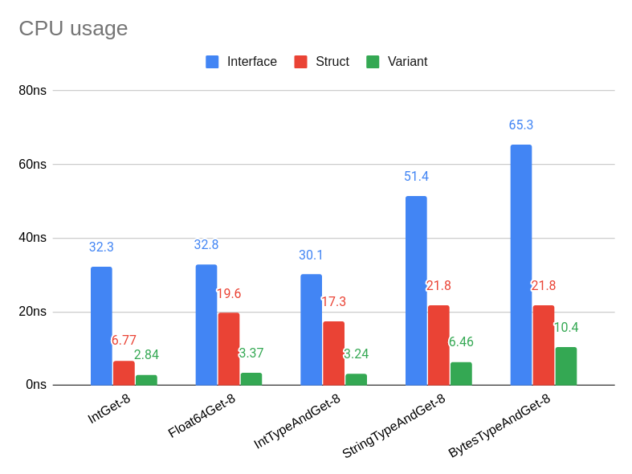

  
  

# Variant data type for Go.

**WARNING: this is an experimental package and is not intended for
production use.**

Variant (also known as [tagged union](https://en.wikipedia.org/wiki/Tagged_union)) allows to store values of one of the following types:

- int,
- float64,
- string,
- []byte slice,
- ordered list of Variant,
- ordered key/value list of Variant, where key is a string.
- empty or no value.

Variant implementation is optimized for performance: for minimal CPU and
memory usage. The implementation currently targets amd64 or 386 GOARCH 
only (it can be extended to other architectures).

This repository includes benchmarks that compare this implementation
of Variant with several other functionally equivalent implementations.

## Benchmarks

To run the benchmarks do `make benchmark`.

Below is a chart that shows CPU usage by certain benchmarked
operations for several variant implementations:

- [Interface](internal/interfacev/interfacev.go) - typical
  interface-based implementation of a variant
  data type (implementations like this are common in Go).
  
- [Struct by Value](internal/plainstruct/plainstruct.go) - a struct
  that holds all possible value types plus
  a tag to store the type of the value. Struct is passed by value.
  
- [Struct by Pointer](internal/ptrstruct/ptrstruct.go) - same as
  above but Struct is passed by pointer.

- [Variant](variant/variant.go) - this implementation.

To see what each specific benchmark does prepend the label in the
x axis with "BenchmarkVariant" and find the corresponding function
(e.g. `BenchmarkVariantIntGet`).

(Benchmarks are for amd64 version, compiled using go 1.15, running
on Ubuntu 18 system with Intel i7 7500U processor).
